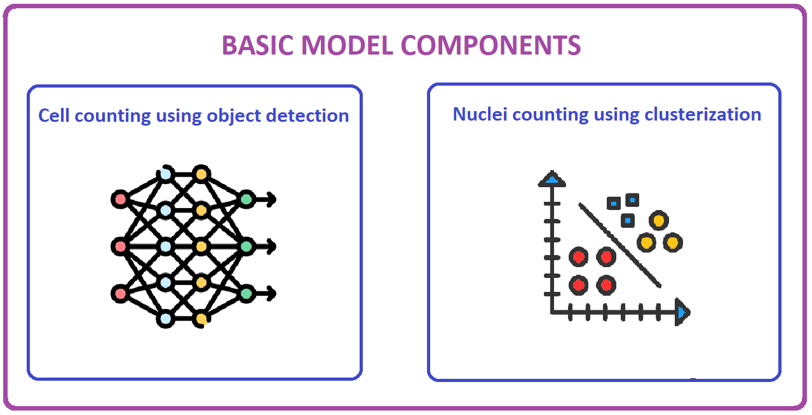

# Cell Calculator

## Brief description

**Cell Calculator** is an innovative application developed by project team "B" for processing mouse fibroblast cells of L929 cell line. It enables processing contrast microscopic images in *.lsm* format, as well as images in standard formats, such as *jpeg*, *png* etc. Its basic functionality involves:
* counting the total number of cells presented on a given image;
* counting the number of stained nuclei presented on a given image (for *lsm* images only);
* calculating the resulting percentage of alive cells presented on a given image (for *lsm* images only).
To perform calculations, the application uses a unique model developed from scratch for this exactly project.

## Get the CellsCalculator app

Should you want to try the CellsCalulator application, follow the guidelines below:
1. On project's GitHub main page, search for **Releases** section in the right menu;
![[Releases]](images/Screenshot_8.png)
2. Click on the latest release available;
3. In the opened release window, go to **Assets** section at the bottom and click on **CellsCalculator.zip** file archive;
![[Assets]](images/Screenshot_9.png)
4. Wait until the archive is completely loaded and then unpack it;
5. Enter the automatically created **CellsCalculator** folder and run the **main.exe** file.
6. Enjoy the application!

Remember: it is forbidden to rename or change location of ANY elements within the **CellsCalculator** directory, as it may badly influence the application behaviour, up to its full crash with unpredictable errors on the way. Please, note that the application does require the *model* folder with *best_m.onnx* file in it in order to calculate cells and work correctly in general.

## Discover what our product is capable of

**CellCalculator** is a huge innovation indeed - just look at in what an awesome way it handles the job of calculating both cells and stained nuclei on given images, achieving nearly state-of-the-art performance on images of proper quality:
![[cells_detected]](images/Screenshot_8_2.png)
*Example of how detected cells can be marked with bounding boxes.*
![[cells_detected]](images/Screenshot_9_2.png)
*However, as more cells appear on an image, it may become complicated to see anything in-between tightly coupled bounding-boxes, that is why the checkbox on the right was designed to turn this option off.*
![[multiple_processing]](images/Screenshot_18.png)
*Have a folder of images? Process it all at once - no need for image-wise processing! Note, that an error may occure in case of non-lsm images, in which case follow the instructions on your screen.*
![[more_multiple_processing]](images/Screenshot_19.png)
*With large folders this option really becomes handy - but keep in mind that unstable lsm format may involve mixed-up image channels, so keep the track of negative percentage and correct it manually afterwards!*

## Model design
The model can be divided into 2 separated submodels:
* Nuclei counter - counts the number of stained nuclei;
* Cell counter - counts the total number of cells.
The model obtains the results from each submodel, and then returns them as a dictionary which includes counts for nuclei, cells, and the resulting percentage.


### Nuclei counter design
The submodel for nuclei counting is based on classical computer vision algorithms used for image pre-processing and DBSCAN clustering algorithm used for differetiating between separated stained nuclei and counting them based on their spatial relations. Additionaly, some statistical-based methods are used for final filtering of the clusters obtained. The hyperparameter values for DBSCAN algorithm have been chosen by fine-tuning them on several images.
![[Nuclei_pipeline]](images/Screenshot_5.png)
If you want to take a look at how the model is designed and why certain elements were implemented, please visit our Colab notebook for more information: [](https://colab.research.google.com/drive/1cpntc3IXbIoR_0kkj4pkOzkzGqZbzueq#scrollTo=8xU2ZH2ahBBm)

### Cell counter design
The submodel for cell counting is a YOLOv8-m object detection deep neural network which calculates cells by simply detecting them.
![[YOLO]](images/YOLO_architecture.png)
It has been trained from scratch for 22 epochs on a third-party dataset(more information is provided in **Data** section below) in Google Colab cloud environment with default T4 GPU using Adam optimizer with default parameters and early stopping as a stopping criterion.
![[Nuclei_pipeline]](images/Screenshot_6.png)
If you want to take a look at how to train the model from scratch, please visit our Colab notebook for more information: [](https://colab.research.google.com/drive/1cpntc3IXbIoR_0kkj4pkOzkzGqZbzueq?usp=sharing)

## Data

Original dataset which had been given to us was a set of unstandardized databases containing contrast images of L929 cells with some stained nuclei. Along with that, in response to our request we had been also given a set of images of cells only so that we could better analyze our model for cell counting.
![[L929_images]](images/target_data.png)

Having performed EDA, it was clear that our data has several serious problems:
- Large data diversity (visually images differed significantly);
- Lack of data (fewer than 300 images available after filtering);
- No labels (no ground truth had been given to us - only the images).

As a result, it was decided to search for third-party datasets of cell microimages which would have visual appearance similar to ours. The dataset we found was LIVECell dataset, containing over 5,000 images (3,000+ training images), which was enough for us to train a deep model.
![[L929_images]](images/livecell_data.png)

The test dataset for evaluating our cell calculating model consists of 95 carefully chosen target images divided into 5 subsets so that images of different images could be analyzed in more details.
![[L929_images]](images/Test_dataset_balance.png)

The test dataset for evaluating the stained nuclei counter model consists of 23 images, on which we could clearly differentiate between actual nuclei and noisy regions when creating ground truth labels.

It should be noted that many pictures have been filtered out due to different reasons, mostly - small cell scale or because of us being unable to infer any ground truth information ourselves due to the low quality of the data.

## Model quality metrics
Below is a list of main model quality metrics. The metrics have been measured on the target test datasets separately for model components for cell calculation and stained nuclei calculation by manually calculating the initial figures (TP, FP, FN, number of predicted instances).

### Nuclei counter
| MAPE | MAE | RMSE | Images | Nuclei |
|---|---|---|---|---|
| 0.059 | 1.0 | 1.629 | 23 | 325 |

### Cell counter

|  | Precision | Recall | F1 score | MAPE | MAPE manual | Images | Cells |
|---|---|---|---|---|---|---|---|
| Subset 1 | 0.961 | 0.962 | 0.961 | 0.042 | - | 8 | 7006 |
| Subset 2 | 0.959 | 0.913 | 0.934 | 0.129 | - | 27 | 7619 |
| Subset 3 | 0.905 | 0.918 | 0.910 | 0.095 | - | 5 | 1200 |
| Subset 4 | 0.898 | 0.989 | 0.938 | 0.156 | - | 30 | 8588 |
| Subset 5 | 0.927 | 0.888 | 0.899 | 0.129 | - | 25 | 9193 |
| Micro Avg / Sum | 0.930 | 0.934 | 0.929 | 0.110 | 0.080 | 95 | 33606 |
| Macro Avg / Sum | 0.929 | 0.935 | 0.927 | 0.128 | 0.100 | 95 | 33606 |

## Run the code

Should you want to run the raw application code, follow the guidelines below. Note that the prompts are designed for Windows CMD - for bash you may need to use other syntax:
1. Clone the repository using the prompt below:
```bash
git clone https://github.com/kikuroki/Cells-calculator.git
```
2. Enter the folder in which the repo is cloned and set up your environment. To do that, you need to have Python 3.7 or above pre-installed. Install the required dependency packages by running:
```bash
pip install -r requirements.txt
```
3. To start the application, execute the ```main.py``` file - you can do that by running:
```bash
python main.py
```
4. Enjoy the application running!
