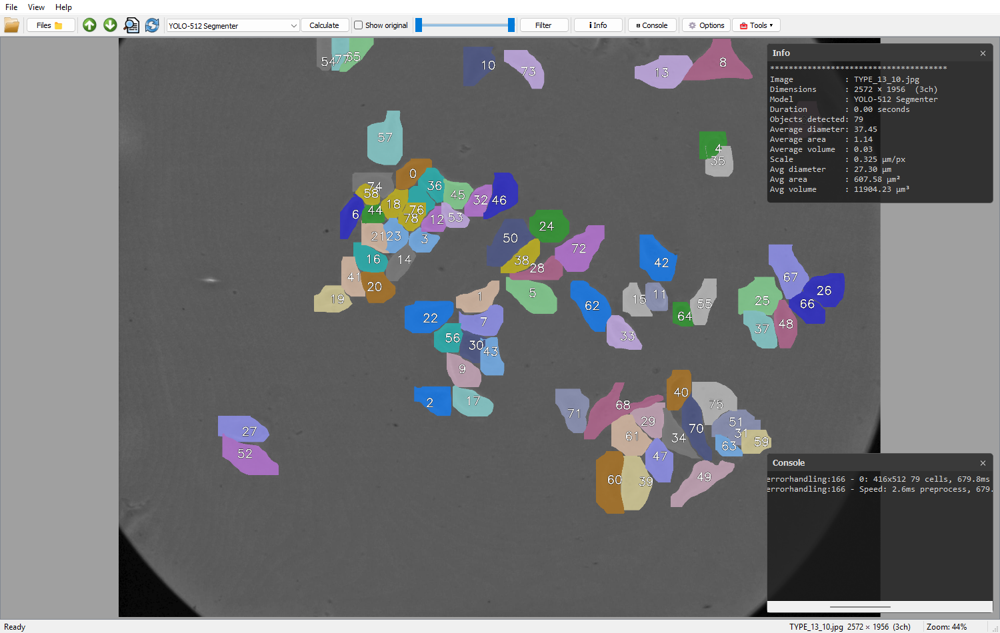

# Cells Calculator (v4.0)

A PyQt5 desktop application for automated **cell / spheroid instance
segmentation and morphology analysis** in microscopy images. Open an image,
pick a model, hit **Calculate**, and the app overlays the detected cell masks
and reports per‑object morphology (area, diameter, extrapolated volume) — in
relative units and, with a pixel‑size calibration, in micrometres.



> **About this version.** v4.0 is a restyled, restructured rebuild of the original
> *CellsCalculator* project. It keeps the proven segmentation core but replaces
> the old plugin/right‑panel UI with a lean floating‑panel interface and a
> single, uniform model seam. See [What's new in v4.0](#whats-new-in-v40) and
> [PROJECT_DOCUMENTATION.md](docs/PROJECT_DOCUMENTATION.md) for the architecture.

## Quick references
* [Features](#features)
* [Available models](#available-models)
* [Install & run](#install--run)
* [Using the app](#using-the-app)
* [Configuring models](#configuring-models)
* [Testing](#testing)
* [Project layout](#project-layout)
* [What's new in v4.0](#whats-new-in-v40)
* [Credits](#credits)

## Features
- **Instance segmentation** with four interchangeable backends (YOLO, InstanSeg,
  Cellpose, StarDist) behind one uniform interface.
- **Morphology metrics** per detection — area, equivalent diameter and a
  sphere‑extrapolated volume — plus averages, reported relative to the image and
  (with calibration) in **micrometres / µm² / µm³**.
- **µm‑per‑pixel calibration** so morphology can be read in physical units.
- **Image formats**: PNG, JPG/JPEG, BMP, GIF, TIF/TIFF, WebP and Zeiss **LSM**
  (multi‑channel, any size).
- **Interactive viewer**: smooth zoom (Ctrl + wheel), pan, fit / 1:1, an
  original ⇄ overlay toggle, and per‑detection hover tooltips.
- **Size filtering**: a range slider filters detections by area on the fly.
- **Measure & select**: Ctrl + click to measure a distance, Shift + click to
  select a region.
- **Threaded inference** with a cancellable progress panel — the UI stays
  responsive while a model runs.
- **Floating panels**: Info, Console (live log), Options, File Browser — each
  draggable and resizable over the viewer.

## Available models
Models are declared in [`modelconfig.json`](modelconfig.json) and listed in the
toolbar dropdown. Out of the box:

| Model | Backend | Weights |
|-------|---------|---------|
| YOLO‑512 Segmenter | Ultralytics YOLO11 | `trainedmodels/YOLO11x-512-seg.pt` |
| InstanSeg Flu_nc | InstanSeg | built‑in `fluorescence_nuclei_and_cells` (downloaded) |
| InstanSeg V3 (512) | InstanSeg | `trainedmodels/instanseg_20250605.pt` |
| Neuroblastoma Inst V3.1 / (512) | InstanSeg | `trainedmodels/Instanseg-Neuroblastoma-v3.1.pt` |
| Cellpose cyto3 | Cellpose | built‑in `cyto3` (downloaded) |
| Stardist trained 0602 | StarDist2D | `trainedmodels/stardist0602/` |

StarDist additionally requires **TensorFlow** (see [Install & run](#install--run)).

## Install & run
Requires **Python 3.13** (3.10+ should work) on Windows, macOS or Linux.

```bash
pip install -r requirements.txt      # runtime dependencies
python main.py
```

Notes:
- **numpy** is pinned to `>=2.1,<2.3` — TensorFlow/ml_dtypes need ≥2.1 on
  Python 3.13, while numba/StarDist need <2.3.
- **StarDist / TensorFlow**: TensorFlow is only needed for StarDist models. On
  Windows its native runtime must initialise before torch/PyQt5, so `main.py`
  imports it first automatically when a StarDist model is enabled.
- Built‑in InstanSeg/Cellpose weights are downloaded on first use; local weights
  live under `trainedmodels/`.

## Using the app
1. **Open** an image (toolbar *Open* or the *Files* browser).
2. Choose a model from the dropdown.
3. Click **Calculate**. Inference runs on a background thread with a progress
   panel; the result image with mask overlays replaces the view and the **Info**
   panel shows the morphology summary.
4. Use **Show original** to toggle the original image, the **size slider** +
   **Filter** to keep only detections in an area range, and **Options** to set
   the **µm/px** scale, toggle labels / polygon fill / tooltips, etc.
5. Hover a detection (with *Show detection tooltip* enabled in Options) to see
   its per‑object metrics.

## Configuring models
`modelconfig.json` maps display names to a backend and weights:

```json
{
  "YOLO-512 Segmenter": { "path": "trainedmodels/YOLO11x-512-seg.pt", "model_type": "yolo", "preload": "true" },
  "Stardist trained 0602": { "enabled": "true", "path": "trainedmodels/stardist0602", "model_type": "stardist" }
}
```

- `model_type`: one of `yolo`, `instanseg`, `cellpose`, `stardist`.
- `path`: a weights file/dir, or a backend built‑in name.
- `enabled`: set `"false"` to hide a model.
- `preload`: `"true"` to warm the backend at startup behind the splash screen.
- InstanSeg entries may add `x20` / `x10` blocks (`tile_size`, `image_preprocess`).

## Testing
```bash
pip install -r requirements-dev.txt
python -m pytest                       # unit + smoke + golden + fuzzing
```
See [DEVELOPMENT.md](docs/DEVELOPMENT.md) for the suite layout, focused runs, the
golden‑baseline regeneration command, and the runtime fuzzer.

## Project layout
This app is a self-contained folder inside the monorepo (`apps/cells-calculator/`):
```
main.py                 # launcher — run `python main.py` from this folder
pyproject.toml          # pytest + mypy config
modelconfig.json        # enabled models (runtime, beside the app)
trainedmodels/          # local model weights (ship beside the app)
src/                    # import root
  app.py                #   startup (splash, model registration, TF preload)
  ui/                   #   PyQt5 UI: MainWindow, ImageViewer, floating panels, …
  model/                #   BaseSegmenter, Model factory, the 4 segmenters, utils
  resources/            #   icons
docs/                   # documentation
tests/                  # unit/, data/, golden/, fuzzing/ + smoke/golden/fuzz tests
```
A deeper description lives in [docs/PROJECT_DOCUMENTATION.md](docs/PROJECT_DOCUMENTATION.md).

## What's new in v4.0
- **Restyled UI**: the old plugin/right‑panel layout is replaced by a single
  image viewer with draggable, resizable floating panels (Info, Console,
  Options, Progress, File Browser).
- **Unified model seam**: every backend now implements one method —
  `call_inference(image) -> DataFrame` — so adding a model is trivial and the UI
  is backend‑agnostic.
- **µm calibration**: morphology can be reported in micrometres via a µm/px
  control.
- **Robust LSM reading** (multi‑channel, any size; the old 512×512 limitation is
  fixed) and a switch to the maintained `tifffile`.
- **Hardening**: zero‑detection, small‑image and non‑finite‑mask edge cases are
  guarded; image writing reports real success; console logging is encoding‑safe.
- **Tests**: unit, smoke, golden‑image regression and a runtime fuzzing harness,
  all runnable via `python -m pytest`.

Earlier release history (V2 plugin architecture, the spheroid tracker, the
nuclei/%‑alive pipeline, x10/SAHI tiling) belongs to the original project and is
not part of the v4.0 rebuild.

## Credits
Developed at NTU "KhPI". For the full contributor list across releases, see
[CONTRIBUTORS.md](docs/CONTRIBUTORS.md). Related resources from the original project:
- Model training: <https://github.com/EugenTheMachine/YOLOcfg.git>
- Segmentation backends: [YOLO](https://docs.ultralytics.com),
  [InstanSeg](https://github.com/instanseg/instanseg),
  [Cellpose](https://github.com/mouseland/cellpose),
  [StarDist](https://github.com/stardist/stardist).
